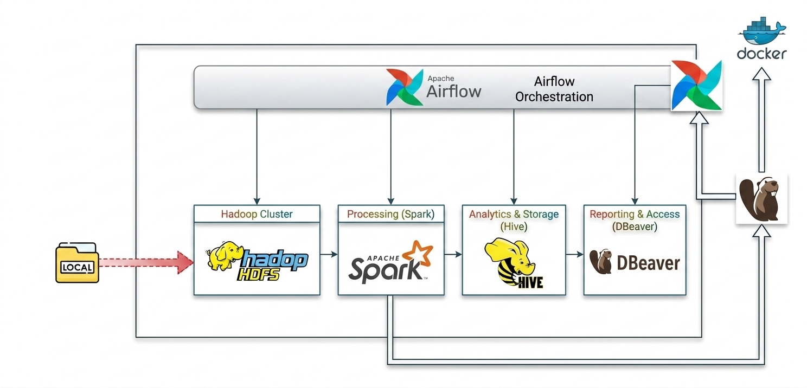
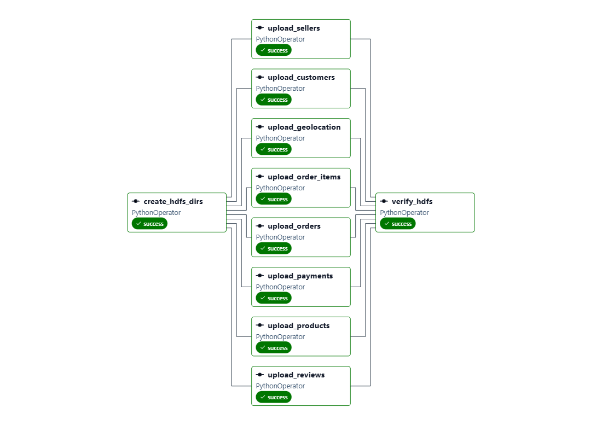
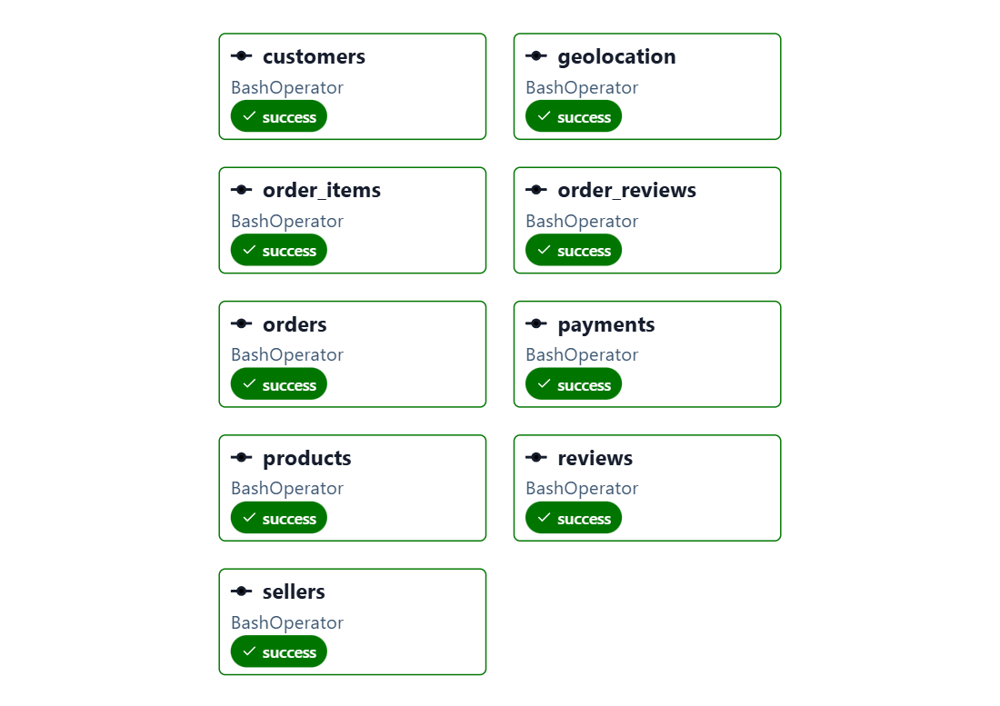

# End-to-End E-Commerce Data Platform

A complete Data Engineering project built with Hadoop, Spark, Hive, Airflow, Docker, and PostgreSQL.

This project demonstrates the design and implementation of a modern batch analytics platform using a medallion architecture (Raw → Silver → Gold) and a dimensional star schema for business reporting.


## dataset overview 
Welcome! This is a Brazilian ecommerce public dataset of orders made at Olist Store. The dataset has information of 100k orders from 2016 to 2018 made at multiple marketplaces in Brazil. Its features allows viewing an order from multiple dimensions: from order status, price, payment and freight performance to customer location, product attributes and finally reviews written by customers. We also released a geolocation dataset that relates Brazilian zip codes to lat/lng coordinates.

This is real commercial data, it has been anonymised, and references to the companies and partners in the review text have been replaced with the names of Game of Thrones great houses.

## Architecture

```text
Raw CSV Data
      │
      ▼
    HDFS
      │
      ▼
 Spark ETL Jobs
      │
      ├── Silver Layer
      │
      ▼
 Gold Star Schema
      │
      ▼
 Hive Data Warehouse
      │
      ▼
 SQL Analytics
      │
      ▼
 Power BI / DBeaver
```

---

## Technologies Used

* Apache Hadoop (HDFS)
* Apache Spark 3.5
* Apache Hive
* Apache Airflow
* PostgreSQL
* Docker & Docker Compose
* Python
* SQL

---

## Infrastructure

The platform is fully containerized using Docker Compose.

### Hadoop Cluster

* 1 NameNode
* 3 DataNodes

### YARN Cluster

* 1 ResourceManager
* 3 NodeManagers

### Data Warehouse

* Hive Server
* PostgreSQL Metastore

### Processing Layer

* Spark Master
* Spark Worker

### Orchestration

* Apache Airflow

---
## Airflow Orchestration

The pipeline is orchestrated using Apache Airflow.
ingestion 


bronze-->silver



silver-->gold
.png)


## Data Pipeline

### Bronze Layer

Raw e-commerce datasets are loaded into HDFS.

Examples:

* Orders
* Customers
* Products
* Sellers
* Order Items
* Payments

### Silver Layer

Spark performs:

* Data cleaning
* Type casting
* Null handling
* Schema normalization

### Gold Layer

Business-ready dimensional model:

#### Fact Table

* fact_order_items

#### Dimension Tables

* dim_customers
* dim_products
* dim_sellers
* dim_orders
* dim_dates
* dim_status

---

## Example Analytics Queries

### Top Revenue Categories

```sql
SELECT
    p.product_category_name,
    ROUND(SUM(f.price),2) AS total_revenue
FROM gold.fact_order_items f
JOIN gold.dim_products p
    ON f.product_id = p.product_id
GROUP BY p.product_category_name
ORDER BY total_revenue DESC
LIMIT 10;
```

### Revenue by State

```sql
SELECT
    c.customer_state,
    ROUND(SUM(f.price),2) AS revenue
FROM gold.fact_order_items f
JOIN gold.dim_customers c
    ON f.customer_id = c.customer_id
GROUP BY c.customer_state
ORDER BY revenue DESC;
```

### Top Sellers

```sql
SELECT
    s.seller_id,
    ROUND(SUM(f.price),2) AS revenue
FROM gold.fact_order_items f
JOIN gold.dim_sellers s
    ON f.seller_id = s.seller_id
GROUP BY s.seller_id
ORDER BY revenue DESC
LIMIT 10;
```

---

## Airflow Orchestration

Airflow schedules and monitors Spark ETL jobs.

Pipeline stages:

1. Load raw data
2. Create Silver tables
3. Build Gold star schema
4. Refresh Hive warehouse

---

## Running the Project

```bash
docker compose up -d
```

Verify services:

* HDFS NameNode UI: http://localhost:9870
* YARN UI: http://localhost:8088
* Spark Master UI: http://localhost:8082
* Airflow UI: http://localhost:8080
* Hive Server2: localhost:10000

---

## Business Value

This project simulates a real-world analytics platform where business users can query curated warehouse tables without interacting directly with raw operational data.

The architecture follows common industry practices used in data engineering teams for large-scale reporting and analytics workloads.
